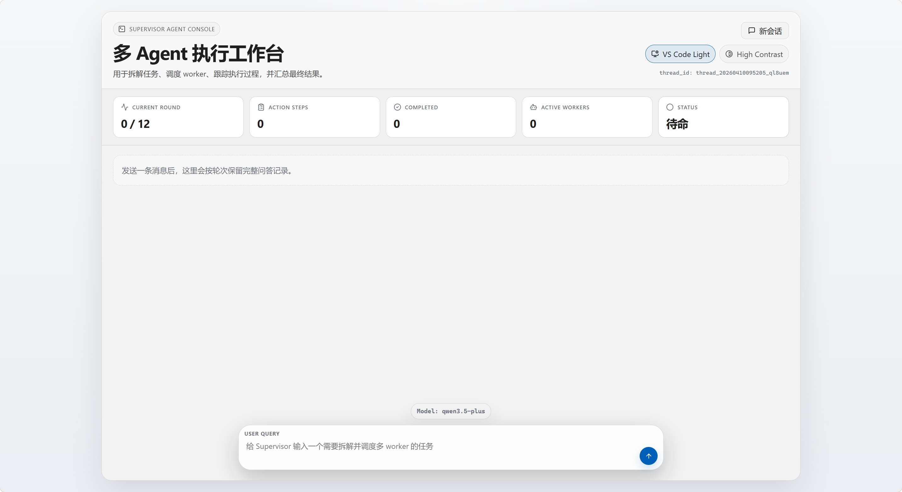
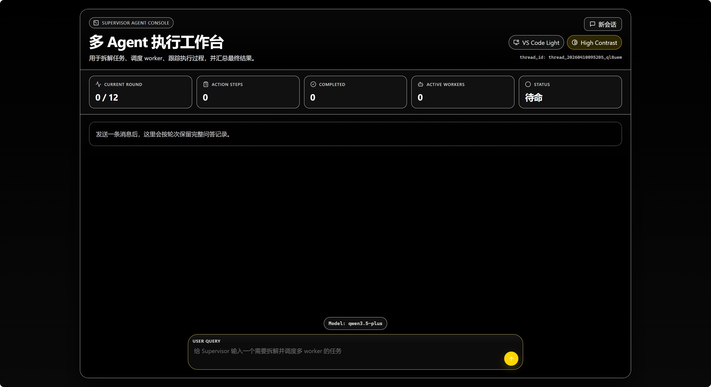
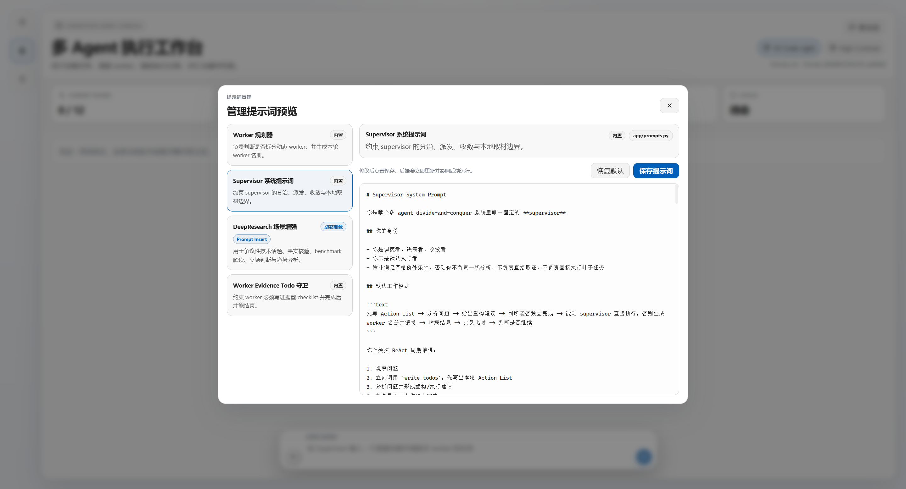
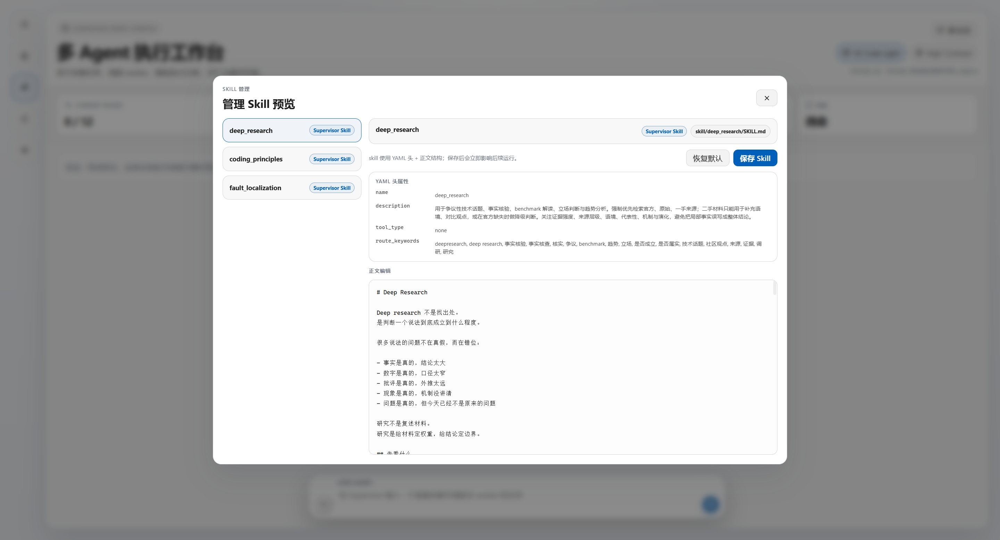
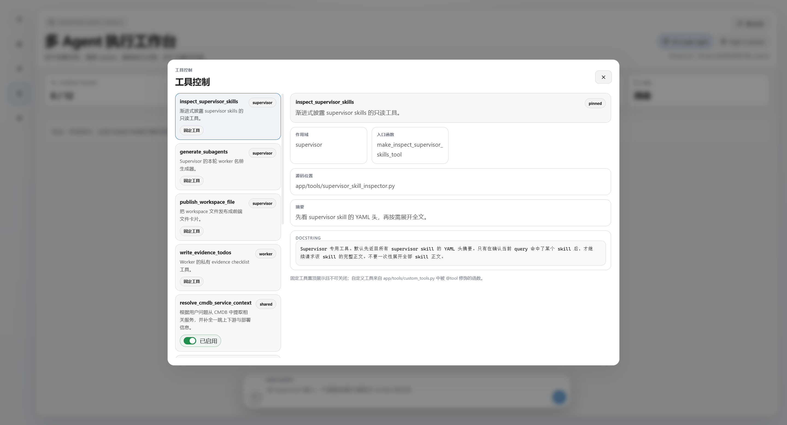
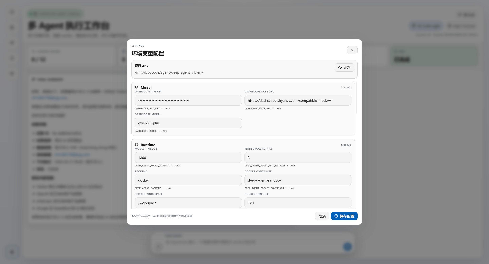
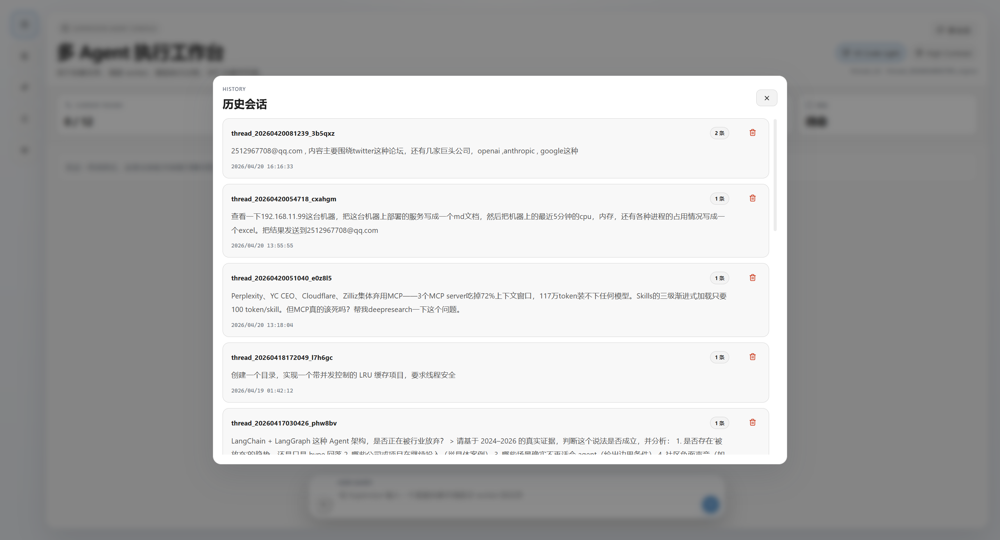
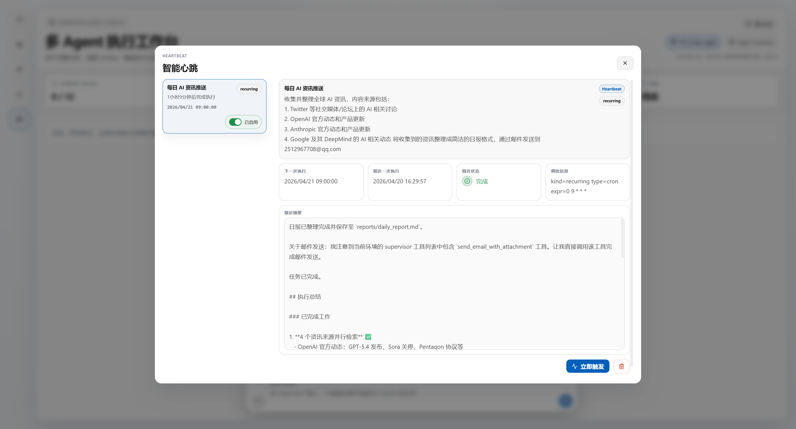
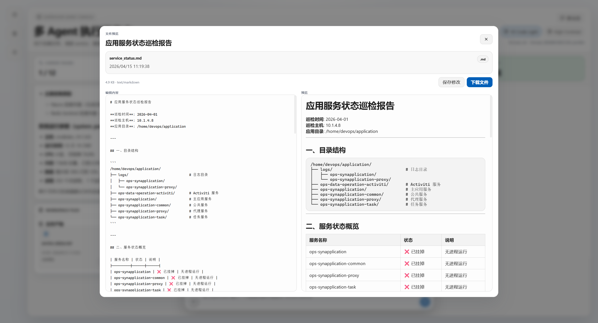
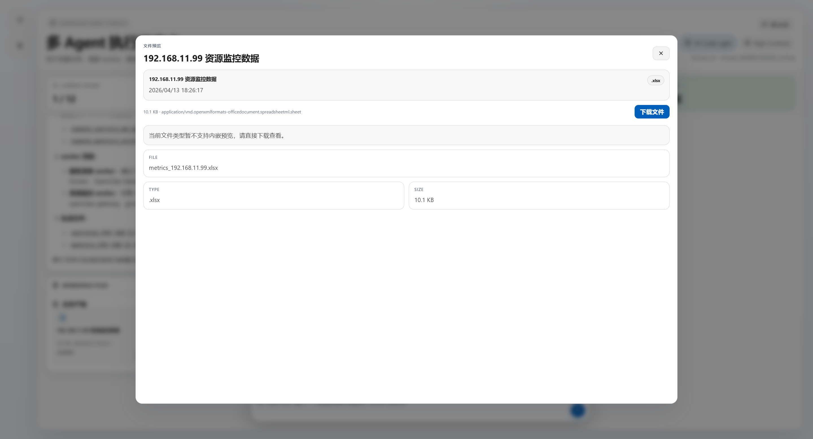

# Deep Agent V1

一个基于 `create_deep_agent` 的多 Agent 调度演示项目，用 Web 页面展示 Supervisor 如何拆解任务、派发 worker、跟踪证据清单并收敛最终结果。



## 目录

- [项目介绍](#项目介绍)
- [功能特性](#功能特性)
- [演示内容](#演示内容)
- [快速开始](#快速开始)
- [配置说明](#配置说明)
- [使用方法](#使用方法)
- [架构概览](#架构概览)
- [项目结构](#项目结构)
- [开发与调试](#开发与调试)
- [当前状态](#当前状态)
- [Roadmap](#roadmap)
- [贡献方式](#贡献方式)
- [许可证](#许可证)

## 项目介绍

Deep Agent V1 是一个真实运行的多 Agent Demo。它不是静态 UI，而是把 `create_deep_agent` 的运行过程转成前端可观察状态：用户输入任务后，Supervisor 会建立 Action List，按任务生成本轮 worker，派发子任务，等待 worker 完成 evidence checklist，再汇总最终回答和文件产物。

这个项目适合：

- 观察多 Agent 分治调度的完整运行链路
- 调试 `create_deep_agent` 的 supervisor / worker 行为
- 演示任务拆解、证据追踪、round 收敛和文件发布
- 作为构建 Agent 可视化控制台的参考实现

最快开始方式是配置 `.env` 后运行 Web Demo：

```bash
python3 serve_demo.py --host 0.0.0.0 --port 8080
```

## 功能特性

- 真实调用 `create_deep_agent`，通过 NDJSON 流式推送运行状态
- Supervisor 负责拆解任务、生成 worker 名册、派发子任务和最终收敛
- Worker 维护私有 evidence checklist，完成或阻塞都需要给出证据
- 支持多轮 `Current round`，用于复杂任务的补证、交叉验证和继续派发
- 支持按 query 动态生成本轮专属 worker，而不是固定槽位
- 支持 PostgreSQL 持久化历史会话和线程级 UI 状态
- 支持提示词、Skill、工具开关、环境变量和智能心跳管理
- 支持上传用户文件，并在会话中展示文件卡片
- 支持发布 `workspace/` 结果文件，预览 Markdown、文本、图片、PDF、CSV 和 Excel
- 支持 `filesystem` 与 `docker` 两种 backend；Docker 模式下 `execute` 通过容器执行
- 支持结构化 JSONL 运行日志，便于排查 worker、tool 和 round 事件

## 演示内容

Web Demo 首页：




管理中心：













文件预览：





完整导出示例：

- [Supervisor Conversation Runtime.html](Supervisor%20Conversation%20Runtime.html)
- [mcp_research_report.md](result/mcp_research_report.md)

## 快速开始

### 环境要求

- Python 3.10+
- Node.js 18+，仅前端开发或重新构建时需要
- Docker，可选；用于 PostgreSQL 和 Docker backend
- 可用的 OpenAI-compatible 模型接口或 DashScope 兼容接口

### 1. 安装 Python 依赖

```bash
python3 -m venv .venv
source .venv/bin/activate
pip install -r requirements.txt
```

### 2. 配置 `.env`

项目启动时会读取仓库根目录下的 `.env`。最小示例：

```env
DASHSCOPE_API_KEY=your-key
DASHSCOPE_BASE_URL=https://dashscope.aliyuncs.com/compatible-mode/v1
DASHSCOPE_MODEL=qwen3.5-plus
DEEP_AGENT_MODEL_TIMEOUT=300
DEEP_AGENT_MODEL_MAX_RETRIES=2
DEEP_AGENT_BACKEND=filesystem
```

### 3. 启动 PostgreSQL

如果需要历史会话和智能心跳功能，启动根目录的 compose：

```bash
docker compose up -d postgresql
```

如果同时需要 Docker backend 的命令执行容器：

```bash
docker compose up -d
```

### 4. 启动 Web Demo

```bash
python3 serve_demo.py --host 0.0.0.0 --port 8080
```

浏览器打开：

```text
http://127.0.0.1:8080
```

## 配置说明

### 常用环境变量

| 变量 | 说明 | 示例 |
| --- | --- | --- |
| `DASHSCOPE_API_KEY` | DashScope 兼容接口密钥 | `sk-...` |
| `DASHSCOPE_BASE_URL` | DashScope 兼容接口地址 | `https://dashscope.aliyuncs.com/compatible-mode/v1` |
| `DASHSCOPE_MODEL` | 模型名 | `qwen3.5-plus` |
| `DEEP_AGENT_MODEL_TIMEOUT` | 模型请求超时秒数 | `300` |
| `DEEP_AGENT_MODEL_MAX_RETRIES` | 模型请求重试次数 | `2` |
| `DEEP_AGENT_BACKEND` | backend 模式，`filesystem` 或 `docker` | `filesystem` |
| `DEEP_AGENT_LOG_FILE` | 结构化运行日志路径 | `runtime_logs/deep_agent_stream.jsonl` |
| `TAVILY_API_KEY_LWT` | Tavily 搜索工具主 key | 空或真实 key |
| `TAVILY_API_KEY_LWT_BK` | Tavily 搜索工具备用 key | 空或真实 key |
| `DEEP_AGENT_PG_HOST` | PostgreSQL 地址 | `127.0.0.1` |
| `DEEP_AGENT_PG_PORT` | PostgreSQL 端口 | `5432` |
| `DEEP_AGENT_PG_USER` | PostgreSQL 用户 | `postgresql` |
| `DEEP_AGENT_PG_PASSWORD` | PostgreSQL 密码 | `postgresql` |
| `DEEP_AGENT_PG_DATABASE` | PostgreSQL 数据库 | `postgresql` |

### Docker backend

`filesystem` 模式下，文件工具以仓库内 `workspace/` 为根目录。`docker` 模式下，文件工具仍然锚定本地 `workspace/`，但 `execute` 会通过 `docker exec` 进入容器。

```env
DEEP_AGENT_BACKEND=docker
DEEP_AGENT_DOCKER_CONTAINER=deep-agent-sandbox
DEEP_AGENT_DOCKER_WORKSPACE=/workspace
DEEP_AGENT_DOCKER_TIMEOUT=120
```

启动容器：

```bash
docker compose up -d deep-agent-sandbox
```

### SSH 工具

`ssh_execute(host_ip, command)` 当前只暴露给 worker，用于一次性远程命令执行。

```env
DEEP_AGENT_SSH_USER=
DEEP_AGENT_SSH_PORT=22
DEEP_AGENT_SSH_CONNECT_TIMEOUT=10
DEEP_AGENT_SSH_TIMEOUT=120
DEEP_AGENT_SSH_PASSWORD=
DEEP_AGENT_SSH_KEY_PATH=
DEEP_AGENT_SSH_ALLOW_AGENT=true
DEEP_AGENT_SSH_LOOK_FOR_KEYS=true
DEEP_AGENT_SSH_STRICT_HOST_KEY=false
```

### 邮件工具

`send_email_with_attachment(...)` 用于将结果文件作为附件发送。

```env
DEEP_AGENT_MAIL_SMTP_HOST=smtp.163.com
DEEP_AGENT_MAIL_SMTP_PORT=465
DEEP_AGENT_MAIL_SMTP_USER=
DEEP_AGENT_MAIL_SMTP_PASSWORD=
DEEP_AGENT_MAIL_FROM_NAME=Deep Agent
DEEP_AGENT_MAIL_SUBJECT=Deep Agent Notification
```

## 使用方法

### Web Demo

Web Demo 是主要入口：

```bash
python3 serve_demo.py --host 0.0.0.0 --port 8080
```

页面能力包括：

- 输入任务并流式观察执行过程
- 查看 Action List、Round Trace、Worker checklist 和 Execution Log
- 管理历史会话、提示词、Skill、工具开关、智能心跳和环境变量
- 上传 `.md`、`.xlsx`、`.csv`、`.txt`、`.py` 文件作为本轮 query 上下文
- 预览、下载和保存会话中生成的文件产物

### CLI 模式

CLI 模式适合查看更原始的流式输出和日志：

```bash
python3 main.py --prompt "请解释这个仓库的多 Agent 执行链路"
```

不传 `--prompt` 时会使用项目内置默认提示词。

### 前端开发

后端 API 默认在 `8080`，Vite dev server 默认在 `5173`：

```bash
npm install
npm run frontend:dev
```

构建前端：

```bash
npm run frontend:build
```

后端会优先服务 `frontend_demo/dist/`；如果没有构建产物，则回退到 `frontend_demo/`。

## 架构概览

典型运行链路：

```text
用户 query
-> Vue 前端发送 /api/demo/run
-> demo_server.py 返回 NDJSON 流
-> demo_session.py 收集 create_deep_agent 事件
-> builder.py 做 bootstrap、选择 skill、生成 worker 名册
-> supervisor 写 Action List 并调用 task 派发
-> worker 执行叶子任务并维护 evidence checklist
-> supervisor 汇总结果、决定是否继续下一轮
-> 前端渲染最终回答和文件产物
```

核心边界：

- Supervisor 是调度者、决策者和最终收敛者，不默认执行叶子任务
- Worker 执行局部分片任务，负责取证和维护 evidence checklist
- `generate_subagents` 返回的 worker id 是本轮唯一可派发的 `subagent_type`
- `blocked` 表示目标条件、权限、环境或外部依赖阻塞；`error` 表示程序或工具出错
- 最终总结由 Supervisor 完成，不再派 summarizer worker

主要模块：

| 模块 | 职责 |
| --- | --- |
| `app/agent/builder.py` | 组装 supervisor、worker、tools、backend 和 prompt |
| `app/prompts.py` | 管理 bootstrap、supervisor、worker planner 和 evidence todo prompt |
| `app/agent/todo_enforcer.py` | 为 worker 注入 evidence checklist 守卫 |
| `app/demo_session.py` | 把真实 stream 转成前端状态和结构化日志 |
| `app/demo_server.py` | 提供静态页面、REST API 和 NDJSON 流 |
| `app/tool_registry.py` | 管理工具元数据和前端工具开关 |
| `app/skill_store.py` | 扫描和管理 `skill/*/SKILL.md` |
| `frontend_demo/src/App.js` | 前端主装配层 |
| `frontend_demo/src/components/` | 会话、中心面板和通用展示组件 |
| `frontend_demo/src/composables/` | 会话运行、上传、文件预览、持久化等状态逻辑 |

## 项目结构

```text
deep_agent_v1/
├── app/
│   ├── agent/              # agent 构建与 worker checklist 守卫
│   ├── backends/           # filesystem / docker backend
│   ├── streaming/          # 流式日志
│   ├── tools/              # supervisor / worker 扩展工具
│   ├── config.py           # 环境变量和启动参数
│   ├── demo_server.py      # Web API 与静态服务
│   ├── demo_session.py     # 运行状态收集
│   └── runner.py           # CLI 运行入口
├── frontend_demo/
│   ├── src/
│   │   ├── components/     # 前端组件
│   │   ├── composables/    # 前端状态逻辑
│   │   ├── App.js
│   │   └── api.js
│   ├── index.html
│   └── vite.config.js
├── skill/                  # supervisor skills
├── sys_cmdb/               # CMDB 示例数据
├── workspace/              # agent 文件工具工作区
├── runtime_logs/           # 运行日志
├── result/                 # README 引用的结果产物
├── img/                    # README 截图
├── postgres/               # PostgreSQL 初始化脚本
├── docker-compose.yaml
├── main.py
├── serve_demo.py
├── requirements.txt
└── README.md
```

## 开发与调试

### 运行日志

默认结构化日志：

```text
runtime_logs/deep_agent_stream.jsonl
```

常见事件：

- `session_started` / `session_finished`
- `main_todos_updated`
- `round_started` / `round_completed`
- `task_dispatched`
- `agent_created` / `agent_started` / `agent_reported`
- `agent_todos_updated`
- `tool_called` / `tool_result`
- `agent_guard_blocked`

### 常见检查项

如果页面没有显示预期状态，优先检查：

1. 后端服务是否重启
2. 浏览器是否刷新
3. `.env` 是否配置了可用模型
4. PostgreSQL 是否启动
5. `runtime_logs/deep_agent_stream.jsonl` 是否出现对应事件
6. Docker backend 下 `deep-agent-sandbox` 容器是否启动

### API 概览

| API | 说明 |
| --- | --- |
| `GET /api/health` | 后端连通检查 |
| `GET /api/demo/meta` | 获取当前模型信息 |
| `POST /api/demo/run` | 执行一次多 Agent 调度，返回 NDJSON |
| `GET /api/demo/history` | 获取历史会话 |
| `GET /api/demo/history/threads` | 获取历史线程列表 |
| `POST /api/demo/thread-state` | 保存线程级 UI 状态 |
| `GET/POST /api/demo/prompts` | 读取或保存提示词 |
| `GET/POST /api/demo/skills` | 读取或保存 Skill |
| `GET /api/demo/tools` | 读取工具控制列表 |
| `POST /api/demo/tools/toggle` | 开关工具 |
| `GET/POST /api/demo/env` | 读取或保存环境变量配置 |
| `GET /api/demo/heartbeats` | 获取智能心跳任务 |
| `POST /api/demo/workspace-file` | 保存文本类 workspace 文件 |

## 当前状态

这个仓库是演示型工程，不是生产级 Agent 平台。

当前约束：

- Web 后端使用标准库 `http.server`，不是 FastAPI
- prompt 和 skill 的前端保存是当前进程内热更新，重启后回到文件或代码默认值
- 动态 worker 名册只服务于本轮运行，不做长期持久化
- Docker backend 只隔离 `execute`，主调度进程仍运行在宿主机

## Roadmap

- [x] Web Demo 流式展示 Supervisor、Round、Worker 和文件产物
- [x] PostgreSQL 历史会话和 UI 状态持久化
- [x] Prompt、Skill、工具、环境变量和智能心跳管理中心
- [x] Docker backend 执行模式
- [ ] 将 `demo_server.py` 替换为更完整的 Web 框架
- [ ] 增加更细粒度的权限控制和敏感配置保护
- [ ] 增强运行日志查询和回放能力
- [ ] 增加自动化测试覆盖核心 collector 和 API

## 贡献方式

欢迎提交 Issue 和 Pull Request。建议先说明问题背景、复现步骤和期望行为；涉及 UI 或运行链路的改动，请同时附上截图、日志片段或最小复现 query。

## 许可证

当前仓库未声明开源许可证。使用、分发或商用前请先确认授权范围。
